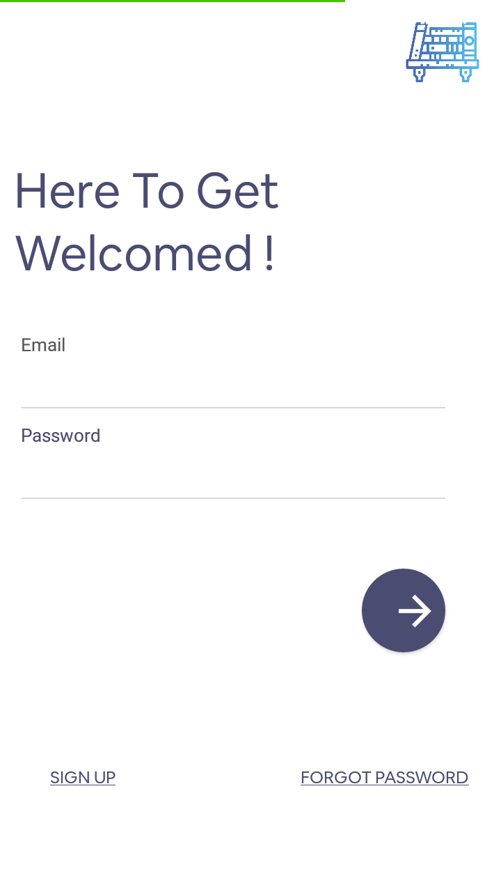
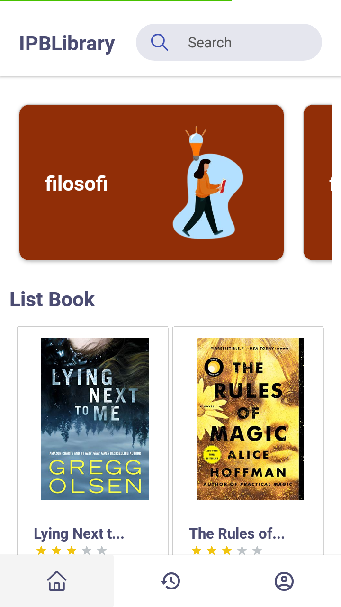
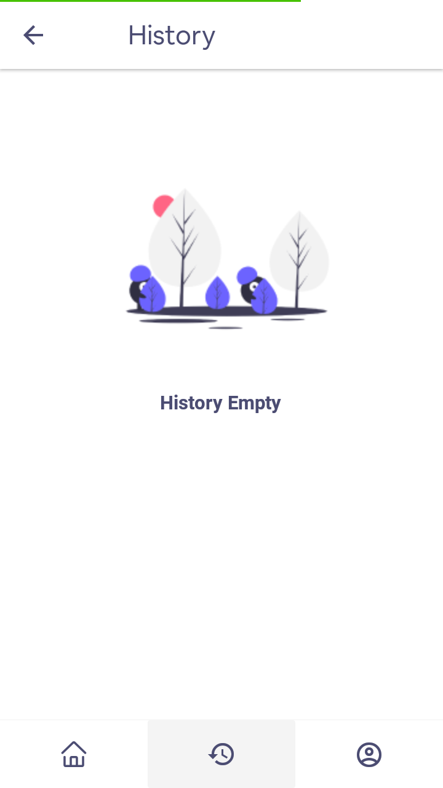
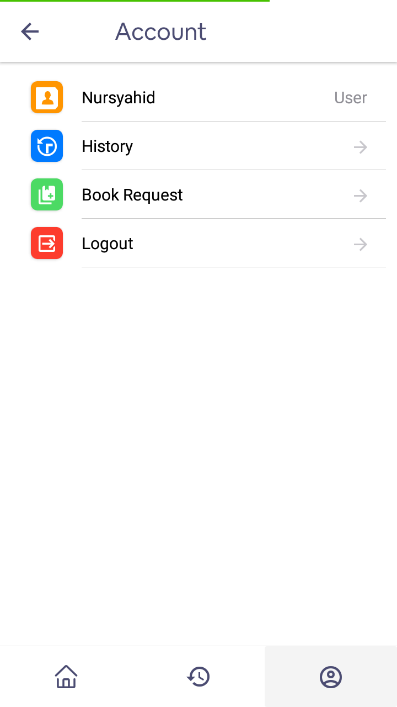

# React Native IPBLibrary Expo 📚


> this app using expo
> to try it at https://expo.io/@brilli/IPBLibrary

## How to use

* use this [link](https://expo.io/@brilli/IPBLibrary) to open project on browser and scan QR code using Expo App

## Running Locally

* Clone this Repository
* Run ``` npm install ``` or  ``` yarn install ```
* Run ``` expo start ```
* Scan code QR and Try it

## The idea behind this project

This project is mobile version from this [app](https://github.com/brillianodhiya/reactjs-rentbook-IPB-Library) and using screen layout clone from [figma react native library](https://www.figma.com/file/shrkaEps4LnHSTkqMxN3cG/Library-Apps?node-id=0%3A1) i use expo cli for this project because just for try React Native using Expo.
This project boostraped using Native-Base

## Screenshot App

<kbd>






<kbd>